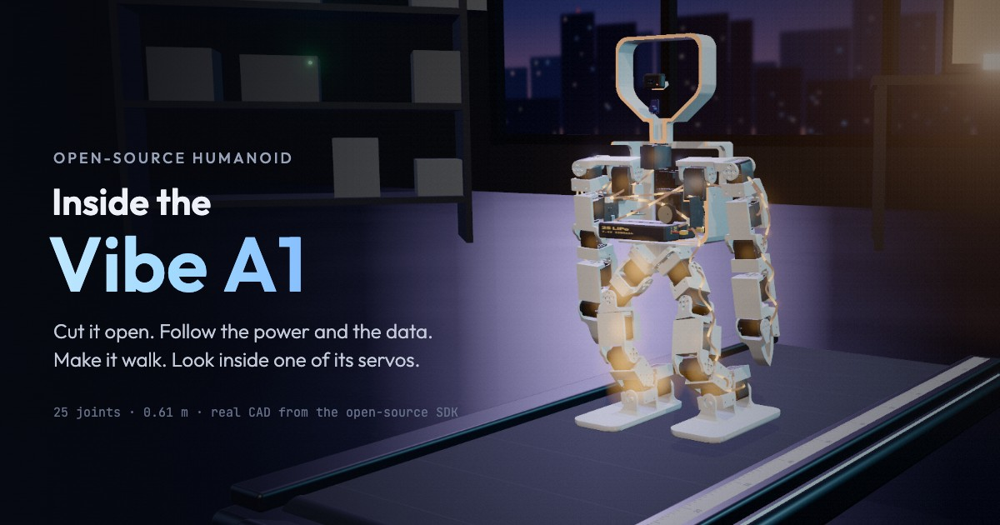

# Inside the Vibe A1

**Live:** https://21nemus.github.io/vibe-a1-explainer/

An interactive three.js explainer of the open-source [Vibe A1](https://www.viberobotics.co/vibe-a1) humanoid robot.
Cut it open, follow the power and the data, make it walk, then look inside one of its 25 servos.



- `vibe-a1/`: the site. Static files, no build step. Details and controls are in [vibe-a1/README.md](vibe-a1/README.md).
- `tools/`: the scripts that build the 3D assets from the [Vibe Robotics SDK](https://github.com/viberobotics/vibe_robotics_sdk).

Run locally:

```bash
cd vibe-a1
npx serve .
```

## Credits

Robot geometry, joint data and the recorded wave come from the Vibe Robotics SDK (Apache-2.0),
Copyright 2026 Vibe Robotics Technologies Inc. See [vibe-a1/assets/robot/NOTICE.md](vibe-a1/assets/robot/NOTICE.md).
Independent project, not affiliated with Vibe Robotics. Vibe A1 is a trademark of Vibe Robotics Technologies Inc.

Made by [@21nemus](https://x.com/21nemus). Original code: MIT ([LICENSE](LICENSE)).
